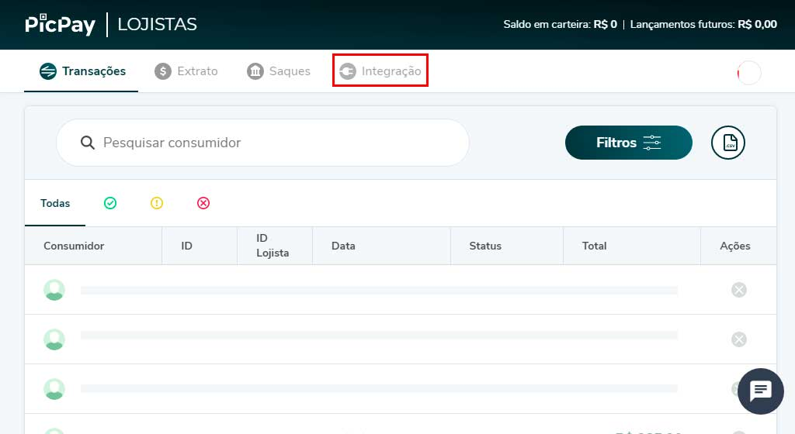
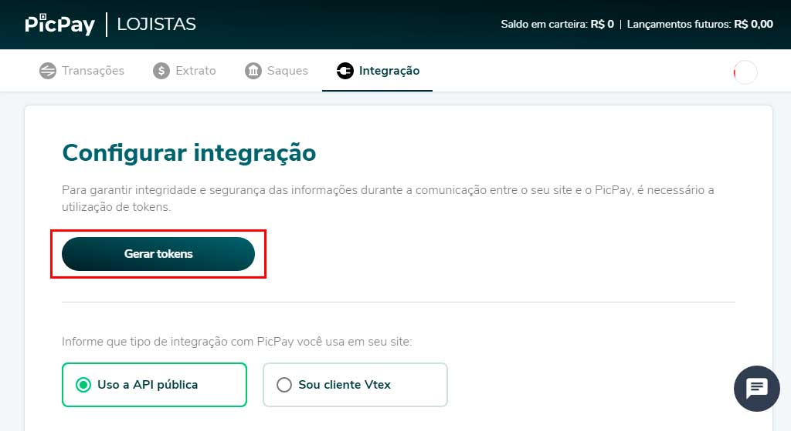
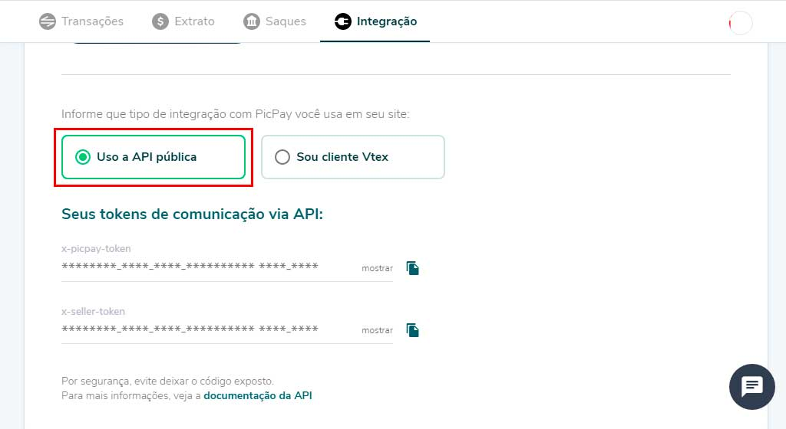

O plugin **WooCommerce Cielo Boleto** permite que logistas aceitem pagamentos via boleto usando a API Cielo. Ao finlizar uma compra os usuários são redirecionados para a URL do boleto.

### Links

- [Cadastro Cielo](https://www.cielo.com.br/e-commerce/)
- [Obtendo credenciais](https://santanamic.github.io/woo-cielo-boleto/#/credentials)
- [Processo de compra](https://santanamic.github.io/woo-cielo-boleto/#/process)
- [Perguntas Frequentes](https://santanamic.github.io/woo-cielo-boleto/#/faq)
 
### Instalação

1. Acesse o painel de administrador do WordPress.
2. Na barra lateral direita, vá para: Plugins > Adicionar novo.
3. No campo de buscas entre com "WooCommerce Cielo Boleto". 
4. Selecione nosso plugin na lista e clique em "Instalar agora".
5. Por fim, clique no botão "Ativar" após a instalação.

### Requisitos

- Uma conta Cielo e-commerce
- Credenciais de acesso para API. (As credenciais são obtidas através do suporte Cielo)
- Certificado SSL.
- Plugin "WooCommerce" ativado e instalado.
- Plugin "WooCommerce Extra Checkout Fields for Brazil" ativado e instalado.
- Versão mínima do PHP  5.6

### Ativando forma de pagamento

1. Acesse o painel de administrador do WordPress.
2. Na barra lateral direita, vá para: WooCommerce > Configurações.
3. Na nova página aberta localize e selecione a aba "Pagamentos".
4. Marque o boão corresponente ao "Cielo Boleto" para selecioná-lo como ativo no checkout.
5. Click em "Gerenciar" para abrir a tela principal de configurações.

### Configuração

Na tela de configurções do plugin insira as demais informações:

- **Ativar / Desativar**  - Ativar para usar. Desativar para desligar.
- **Título**  - Escolha o título exibido aos clientes durante o checkout.
- **Descrição**  - Adicionar informações mostradas aos clientes no checkout.
- **MerchantId** - Identificador da loja na API Cielo eCommerce.	.
- **MerchantKey** - Chave Publica para Autenticação Dupla na API Cielo eCommerce.	.
- **Habilitar Log** - Quando estiver marcado ativa o registro de log para o plugin.

------------

# Obtendo credenciais

Obtenha as credenciais de acesso para a comunicação entre a API Cielo e o plugin **WooCommerce Cielo Boleto**. As credenciais de acesso identificam você como titular de uma conta, são fornecidas de maneira a autorizar o uso de funcionalidades específicas de uma API junto a sua integração.

### Acesso a conta

Isso se aplica caso você ainda não possua as credenciais de API da Cielo. Você precisa de uma conta [Cielo eCommerce](https://www.cielo.com.br/e-commerce/) para continuar.

### Procedimentos

1. Entre na sua conta do PicPay e-commerce em: [https://lojista.picpay.com/dashboard](https://lojista.picpay.com/dashboard).

2. Localize e clique no menu "Integração" e aguarde a nova tela aberta.

3. Na nova tela, click no botão em destaque "Gerar Tokens". 

4. Certifique-se que a opção tipo de integração "Uso a API pública", esteja marcada. 

5. Copie e guarde as informações dos campos **x-picpay-token** e **x-seller-token**.

6. Use as credenciais para [configurar](README?id=configuração) as opões do plugin.

------------

# Processo de compra

O processo de compra descreve as etapas necessárias para o registro e finaliação de uma venda utilizando o plugin **WooCommerce Cielo Boleto**.

### Fluxo do checkout

Os clientes deixam o seu site a partir da página do finaliação de compra para imprimir ou salvar o Boleto. O boleto pode ser pago em qualquer agência da rede bancária, casas lotéricas ou banco postal.

### Cenário típico

- O cliente entra em seu site.
- O cliente adiciona produtos ao carrinho.
- O cliente fecha a compra e vai para o checkout.
- Na página de checkout, o cliente preenche os dados de endereço e cobrança.
- Após, o cliente seleciona a forma de pagamento "Cielo Boleto" e solicita o pedido.
- O cliente é redirecionado para a página de agradecimento e relação do pedido.
- Uma nova janela é abeta para visualização do Boleto. 
- O cliente efetua o pagamento da cobrança.
- O pagamento é processado pelo banco e confirmado pela API cielo.
- Uma notificação de API é enviada para o loja e tratada pelo plugin "WooCommerce Cielo Boleto".
- O plugin "WooCommerce Cielo Boleto" altera o status da ordem com base no novo status de pagamento recebido.

------------

# Site oficial

https://ajuda.picpay.com/picpay