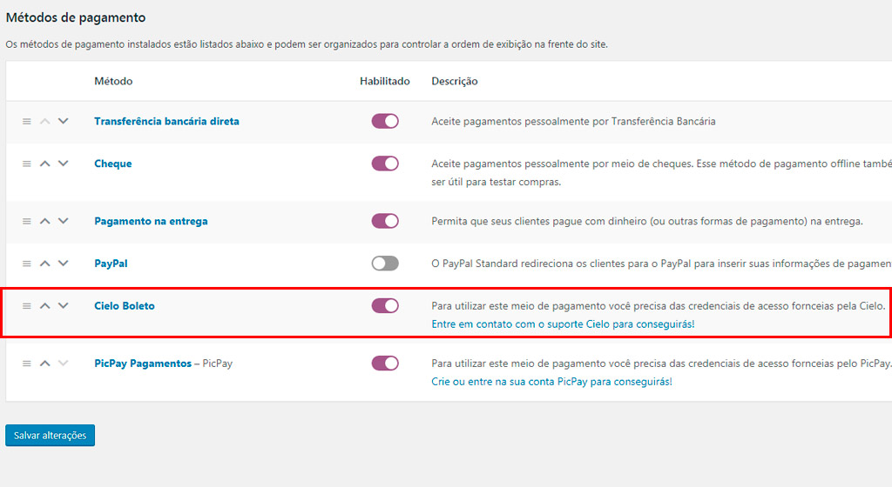
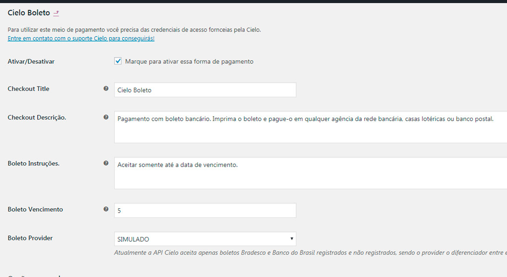
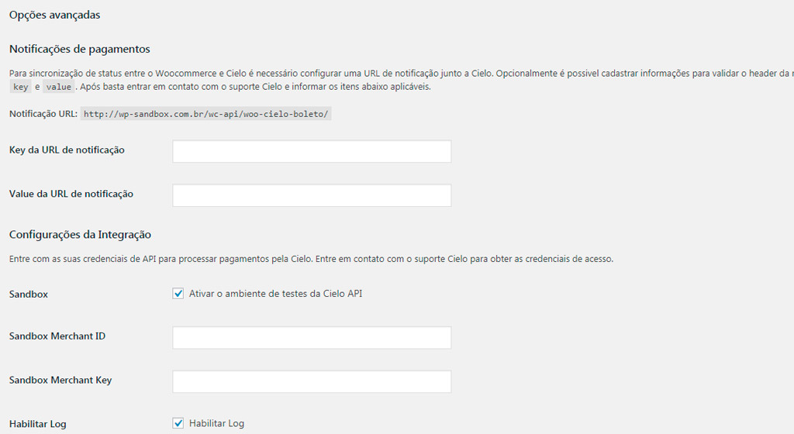

O plugin **WooCommerce Cielo Boleto** permite que lojistas aceitem pagamentos via boleto usando a API Cielo. Ao finlizar uma compra os usuários são redirecionados para a URL do boleto.

### Links

- [Cadastro Cielo](https://www.cielo.com.br/e-commerce/)
- [Obtendo Credenciais](#obtendo-credenciais)
- [Processo de compra](#processo-de-compra)
- [Perguntas Frequentes](#perguntas-frequentes)
 
### Instalação

1. Acesse o painel de administrador do WordPress.
2. Na barra lateral direita, vá para: Plugins > Adicionar novo.
3. No campo de buscas entre com "WooCommerce Cielo Boleto". 
4. Selecione nosso plugin na lista e clique em "Instalar agora".
5. Por fim, clique no botão "Ativar" após a instalação.

### Requisitos

- Uma conta Cielo e-commerce
- Credenciais de acesso para API. (As credenciais são obtidas através do suporte Cielo)
- Certificado SSL.
- Plugin "WooCommerce" ativado e instalado.
- Plugin "WooCommerce Extra Checkout Fields for Brazil" ativado e instalado.
- Versão mínima do PHP  5.6

### Ativando forma de pagamento

1. Acesse o painel de administrador do WordPress.
2. Na barra lateral direita, vá para: WooCommerce > Configurações.
3. Na nova página aberta localize e selecione a aba "Pagamentos".
4. Marque o boão corresponente ao "Cielo Boleto" para selecioná-lo como ativo no checkout.
5. Click em "Gerenciar" para abrir a tela principal de configurações.

### Configuração

Na tela de configurções do plugin insira as demais informações:

- **Ativar / Desativar**  - Ativar para usar. Desativar para desligar.
- **Título**  - Escolha o título exibido aos clientes durante o checkout.
- **Descrição**  - Adicionar informações mostradas aos clientes no checkout.
- **MerchantId** - Identificador da loja na API Cielo eCommerce.	.
- **MerchantKey** - Chave Publica para Autenticação Dupla na API Cielo eCommerce.
- **Boleto Vencimento** - O número de dias para o vencimento do Boleto.
- **Boleto Provider** - Banco emissor, cadastrado junto ao suporte Cielo.
- **Key da URL de notificação** - Um parâmetro key para a validação do header da requisição.
- **Value da URL de notificação** - Um parâmetro value para a validação do header da requisição.
- **Sandbox Merchant ID** - Merchant ID do sandbox.
- **Sandbox Merchant Key** - Merchant Key do sandbox.
- **Habilitar Log** - Quando estiver marcado ativa o registro de log para o plugin.

------------

# Obtendo credenciais

Obtenha as credenciais de acesso para a comunicação entre a API Cielo e o plugin **WooCommerce Cielo Boleto**. As credenciais de acesso identificam você como titular de uma conta, são fornecidas de maneira a autorizar o uso de funcionalidades específicas de uma API junto a sua integração.

### Solicitando credenciais

A solicitação é realizada através de um formulário. Portanto preencha todos os campos. Tenha em mãos o número do estabelecimento comercial, pois ele será essencial para que você solicite os tokens para a integração.

### Procedimentos

1. Faça o download do formulário de homologação [Formulário de Homologação](https://cieloecommerce.cielo.com.br/Backoffice/Areas/Merchant/Content/documents/Formulario_de_Homologacao_WebService3.0.docx).
2. Preencha o formulário completamente.
3. Encaminhe este formulário completamente preenchido para o email cieloecommerce@cielo.com.br. 
4. Em caso de dúvidas técnicas ou demais informações sobre a plataforma Cielo e-Commerce, entre em contato com o Suporte Web do Cielo e-Commerce no e-mail cieloecommerce@cielo.com.br.

### Sandbox

Para facilitar os testes durante a integração, a Cielo oferece um ambiente Sandbox.

**Vantagens de utilizar o Sandbox**

- Não é necessário uma afiliação para utilizar o Sandbox Cielo.
- Basta acessar o [Cadastro do Sandbox](https://cadastrosandbox.cieloecommerce.cielo.com.br/) e criar uma conta.
- Com o cadastro você receberá um MerchantId e um MerchantKey,que são as credenciais necessarias para os métodos da API

------------

# Processo de compra

O processo de compra descreve as etapas necessárias para o registro e finaliação de uma venda utilizando o plugin **WooCommerce Cielo Boleto**.

### Fluxo do checkout

Os clientes deixam o seu site a partir da página do finaliação de compra para imprimir ou salvar o Boleto. O boleto pode ser pago em qualquer agência da rede bancária, casas lotéricas ou banco postal.

### Cenário típico

- O cliente entra em seu site.
- O cliente adiciona produtos ao carrinho.
- O cliente fecha a compra e vai para o checkout.
- Na página de checkout, o cliente preenche os dados de endereço e cobrança.
- Após, o cliente seleciona a forma de pagamento "Cielo Boleto" e solicita o pedido.
- O cliente é redirecionado para a página de agradecimento e relação do pedido.
- Uma nova janela é abeta para visualização do Boleto. 
- O cliente efetua o pagamento da cobrança.
- O pagamento é processado pelo banco e confirmado pela API cielo.
- Uma notificação de API é enviada para o loja e tratada pelo plugin "WooCommerce Cielo Boleto".
- O plugin "WooCommerce Cielo Boleto" altera o status da ordem com base no novo status de pagamento recebido.

------------

# Perguntas Frequentes

Confira o nosso banco de perguntas e respostas mais frequentes. Caso não encontre a solução para o seu problema, abra um chamado e envie sua pergunta para nosso time de especialistas.

### Dúvidas de Negócio

#### 1. O que é a API Cielo eCommerce?

A API Cielo eCommerce é a evolução do webservice 1.5 como motor transacional online CIELO. Ele fornece uma API que permite ao lojista cielo realizar uma integração simplificada e modular A solução API Cielo eCommerce da plataforma Cielo eCommerce foi desenvolvida com a tecnologia REST. 

É possível integrar-se utilizando as mais variadas linguagens de programação, tais como: ASP, ASP. Net, Java, PHP, Ruby, Python, etc.

#### 2. Qual a diferença entre o Webservice 1.5 e a API Cielo eCommerce?

- A API Cielo eCommerce oferece novas funcionalidades além de um modelo de integração simplificado.
Integração simplificada - Utilizando um API REST, substituindo o envio de XMLs para a autorização de pagamentos
- Novos meios de pagamento - Além de cartões de crédito e débito a API Cielo eCommerce permite aos lojistas o pagamento via Boletos e transferência eletrônica do Banco do Brasil e Bradesco
- Recorrência Programada - A API Cielo eCommerce permite ao lojista criar um processo de recorrência automática, sem a necessidade de armazenar dados do cartão. Basta enviar a transação e o intervalo de execução
- Tokenização de cartões - A API Cielo eCommerce permite que o lojista salve cartões de seus clientes, seja para transações de recorrência ou para criação de wallets. O lojista recebe tokens que podem ser utilizados para realizar novas transações. Dessa maneira a cielo garante a segurança e a facilidade de acesso do lojista a uma base própria de cartões e dados de pagamento.
- Zero Auth - Nova feature que permite ao lojista testar um cartão e verificar se ele se encontra apto a realizar uma determinada transação - Disponibilidade sugeita a aprovação comercial.
- Consulta de Bins - feature que permite a validação do tipo de cartão (Crédito/débito) - Disponibilidade sugeita a aprovação comercial.
- Integração com as principais Wallets - A API Cielo eCommerce ja está integrada com a Visa Checkout e a MasterPass, carteiras das bandeiras Visa e MasterCard, permitindo assim o lojista ter acesso a uma maior gama de clientes.
- Antifraude - é disponibilizado na API Cielo eCommerce Cielo uma análise de risco das transações de cartões de crédito, assim elevando a segurança do lojista e diminuindo o risco de chargebacks

#### 3. Quais são os meios de pagamentos aceitos na API Cielo eCommerce?

A API Cielo eCommerce Cielo aceita os seguintes meios de pagamento:

- Cartões de crédito: Visa / Mastercard / American Express / ELO / Aura / Diners / Discovery / JCB
- Cartões de Débito: Visa Eletron / MasterCard
- Boletos: Banco do Brasil e Bradesco
- Transferencia eletrônica (Débito online): Banco do Brasil e Bradesco

#### 4. Posso manter uma integração 1.5 e uma API Cielo eCommerce ao mesmo tempo?

Não é possível manter duas integrações simultâneas do webservice 1.5 e da API Cielo eCommerce Ao realizar o cadastro de uma das integrações junto ao Cielo Ecommerce será necessário escolher entre uma das plataformas Para maiores informações acesse: https://www.cielo.com.br/desenvolvedores A migração para a API Cielo Ecommerce é obrigatoria. O WebService 1.5 foi descontinuado e não possui suporte ou novos desenvolvimentos.

#### 5. Não possuo a integração 1.5, posso utilizar a API Cielo eCommerce?

Sim, a integração da API Cielo eCommerce não depende uma integração previa ao webservice 1.5. Basta realizar um cadastro junto a Cielo, obtendo assim suas credenciais para transacionar Acesse https://www.cielo.com.br/desenvolvedores para maiores informações.

#### 6. Como posso realizar a migração da 1.5 para a API Cielo eCommerce?

A Cielo disponibiliza um ambiente de Sandbox (https://bit.ly/2cHdrzr), onde desenvolvedor pode iniciar um processo de aprendizagem sobre a integração da API.

Após entender a integração, é necessário entrar em contato com o suporte e-commerce Cielo e solicitar a criação de novas credenciais de acesso ao ambiente de produção, assim será possível iniciar a integração em produção.

Para mais informações, acesse: https://developercielo.github.io/Guia-de-migracao-1.5x3.0

#### 7. Possuo a 1.5, é necessário realizar uma nova homologação para utilizar a API Cielo eCommerce?

Sim, é necessário realizar uma nova homologação para validar a capacidade transacional de seu site. Para se integrar a API Cielo eCommerce em produção será necessário solicitar novas credenciais e iniciar uma nova homologação

#### 8. Como posso liberar outros meios de pagamento?

Para liberar novos meios de pagamento, você deve entrar em contato com o suporte do Cielo ecommerce e solicitar a ativação do meio de pagamento desejado.

#### 9. Onde posso acompanhar minhas vendas pela API Cielo eCommerce?

Via a área do lojista, no site https://minhaconta.cielo.com.br/wps/portal/est2/login

### Dúvidas Técnicas

#### 1. Como funciona a solução API Cielo eCommerce da Cielo?

A solução API Cielo eCommerce da plataforma Cielo eCommerce foi desenvolvida com a tecnologia REST. O modelo empregado é bastante simples: Existem duas URLs (endpoint), uma específica operações que causam efeitos colaterais - como autorização, captura e cancelamento de transações, e uma URL específica para operações que não causam efeitos colaterais, como pesquisa de transações.

#### 2. Há mudanças nas credenciais da 1.5 para a API Cielo eCommerce?

Sim, as credenciais utilizadas em cada plataforma são diferentes:

- 1.5 - São utilizadas a AFILIAÇÃO e a CHAVE DE PRODUÇÃO. Essas crendenciais identificam a loja e a conta destino ao qual o valor da transação será depositado de acordo com a agenda financeira Cielo. Devem ser enviadas no corpo da requisição. A Afiliação é o código de identificação do cadastro da loja na Cielo.

- API Cielo eCommerce - São utilizadas novas credenciais, MerchantId e MerchantKey. Essas credenciais são utilizadas para identificar a loja. Caso não sejam enviadas no Header da requisição, a transação será bloqueada pela API, retornando “Error”. Numa integração com a API Cielo eCommerce não é possível enviar credenciais da 1.5. A API negará as requisições.

**Exemplos**

1.5

- **Afiliação**: `1000000000`
- **Chave de produção**: `bf7001e4a4530004090d782b0b7d0a932d07fedffscb2332d7S3fc2b6S8f7c3c`

API Cielo eCommerce

- **MerchantId**: `0d8b08ab-26ea-400e-9a22-47e58057642b`
- **MerchantKey**: `keR10a0P3R01T0h0C0a0T00U0vsoOy0X0p0Dqyib`

?> Caso não saiba suas credenciais, entre em contato com o Suporte Cielo e informer o seu CNPJ/CPF. As credenciais serão enviadas ao e-mail cadastrado.

#### 3. Como consigo as credenciais de cada ambiente?

Existem dois ambientes na API Cielo eCommerce, Sandbox e Produção.

- **Sandbox**: basta acessar https://cadastrosandbox.cieloecommerce.cielo.com.br/ e realizar um cadastro, suas credenciais serão exibidas após o cadastro
- **Produção**: é necessário entrar em contato com a central de credenciamento Cielo e solicitar suas credenciais. Elas serão enviadas via e-mail. Sobre a central de credenciamento acesse https://developercielo.github.io/Guia-de-migracao-1.5x3.0/#suporte-cielo 

#### 4. Preciso fazer uma afiliação antes de testar a integração?

Não é necessária uma afiliação para utilizar o Sanbox Cielo. Basta acessar o Cadastro do Sandbox e criar uma conta de testes. Ao fim do cadastro você receberá um MerchantId e um MerchantKey, que deverão ser utilizados para autenticar todas as requisições feitas para os endpoints da API.

#### 5. Como testar transações com meios de pagamento simulado?

Para realizar testes na API Cielo eCommerce, não é necessário utilizar cartões / meios de pagamentos reais. Cada meio de pagamento (Crédito, Débito, boleto e Transferência online) possui uma contra parte simulada.

- **C. Crédito** - Basta utilizar o Provider “Simulado” e enviar um dos cartões contidos no Manual de integração
- **Boleto** - Será gerado um boleto invalido.
- **C. Debito** - Você será redirecionado a uma tela onde poderá selecionar o resultado da operação
- **Transferência online** - Você será redirecionado a uma tela onde poderá selecionar o resultado da operação

#### 6. É necessário usar algum certificado em para realizar a conexão com a API Cielo eCommerce?

Sim, é necessário realizar a instalação do certificado SSL EV. Mais informações no [Manual de integração](https://developercielo.github.io/manual/cielo-ecommerce)

#### 7. É necessário algum protocolo de segurança para a utilização da API Cielo eCommerce?

SSL,TLS 1.0 e 1.1 não são suportados. Integrações utilizando esses protocolos não poderão realizar transações.

------------

# Screenshots

Screenshots são capturas de telas do sistema:

#### 1. O painel de configurações usado para habilitar e configurar o gateway

<figure class="thumbnails">
    
    
    
</figure>

